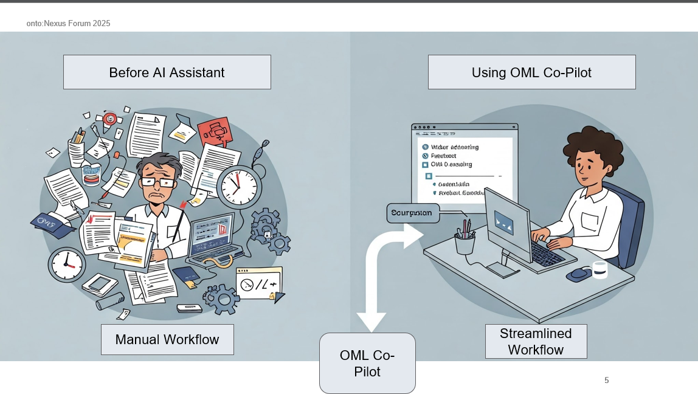
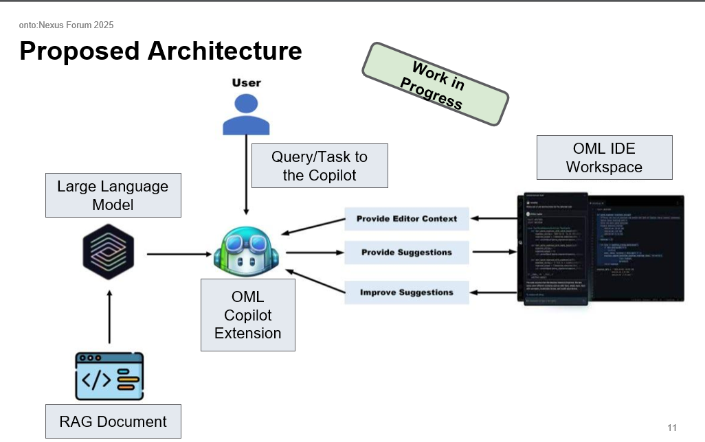

# OML-Copilot



## Overview
OML-Copilot is an AI assistant designed to make Ontological Modeling Language (OML) more accessible to systems engineers. By combining natural language processing with formal grammar validation, this tool reduces the cognitive burden of OML syntax and allows engineers to focus on their domain expertise.

Presented at NASA JPL's onto:Nexus Forum 2025, this project addresses key challenges in OML modeling and provides a streamlined workflow for creating valid OML code from natural language prompts.

## The Challenge
Modeling with OML currently presents several challenges:
- **High expertise barriers** for both conceptual modeling and OML syntax
- **Dependency management** complexity across vocabulary libraries
- **Limited assistance features** compared to programming languages
- **Error-prone semantic reasoning** that's difficult to debug
- **Repetitive modeling tasks** that could benefit from automation

## Our Solution
OML-Copilot bridges the gap between domain expertise and OML implementation through:
- **Natural language to OML code generation**
- **Real-time syntax validation** with specific error feedback
- **Intelligent dependency management** for vocabulary libraries
- **Iterative feedback loops** that progressively improve output quality
- **Retrieval-Augmented Generation (RAG)** with relevant example retrieval

## Key Features
- **Grammar-Aware Validation**: Validates generated code against formal OML grammar
- **Intelligent Context Retrieval**: Finds highly relevant OML examples based on specific needs
- **Iterative Feedback Loop**: Learns from corrections to improve generation quality
- **Vocabulary Dependency Management**: Automatically detects and manages vocabulary libraries
- **VS Code Integration**: Seamless integration with development environments

## Architecture
OML-Copilot uses a combination of techniques:
- Large Language Models (Mistral)
- Retrieval-Augmented Generation (RAG)
- Grammar parsing and validation (Lark)
- Iterative error correction
- VS Code extension (Continue)




### Example Usage
```
User: "Create a vocabulary for musical instruments that includes classification by family"

OML-Copilot generates syntactically correct OML vocabulary with:
- Appropriate vocabulary definition and namespace
- Instrument concept with family classification
- Relations between instruments and their properties
- Validation to ensure code correctness
```

## Installation

```bash
# Clone the repository
git clone https://github.com/ajaysreekumar47/OML-Copilot.git
cd OML-Copilot

# Install dependencies
pip install -r requirements.txt

# Set up environment
python setup.py install
```


## Presentation
- [onto:Nexus Forum 2025 Presentation](https://www.youtube.com/watch?v=fleR6-Fiazo)

## Research Process
This project was developed through several stages:
1. Understanding GitHub Copilot functionality and OML fundamentals
2. Experimenting with prompting techniques using various LLMs
3. Developing grammar parsing and validation mechanisms
4. Creating a dataset of OML examples for training and retrieval
5. Implementing RAG with optimized search methods
6. Building dependency management and error handling
7. Developing structured output generation
8. Creating an interactive demo and VS Code integration

## Contributors
- [Ajay Sreekumar](https://ajaysreekumar47.github.io) - University of Arizona

## Acknowledgments
This project was developed as part of a research collaboration with:
- Dr. Alejandro Salado - University of Arizona
- Maged E Elasaar - NASA JPL
- Polydoros Giannouris - University of Manchester
- Burak Yetistiren - UCLA
- Joe Gregory - University of Arizona

## License
This project is licensed under the MIT License - see the [LICENSE](LICENSE) file for details.
