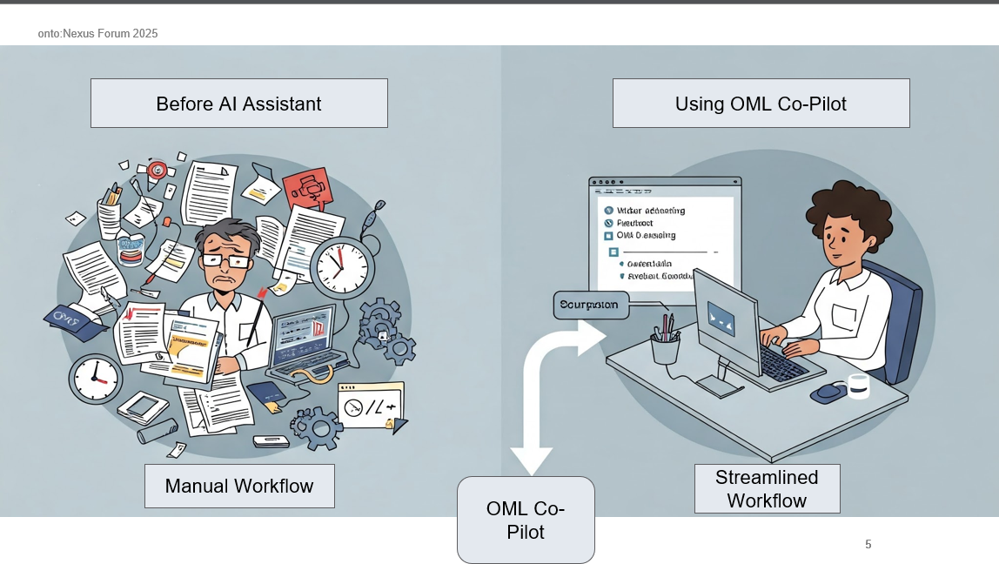
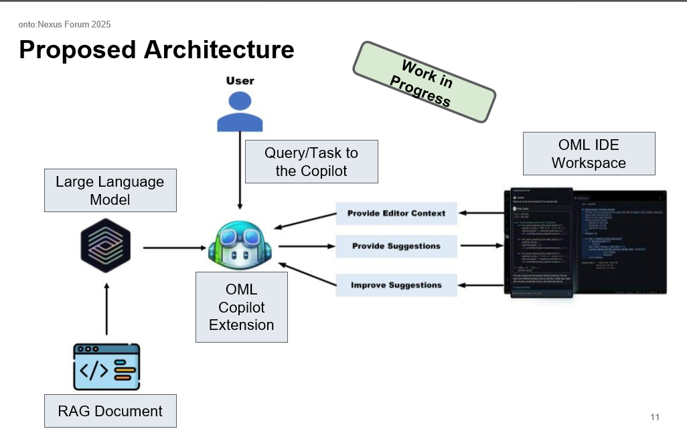
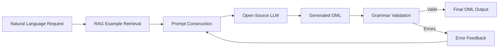

# OML-Copilot

> Agentic AI assistant for generating and validating Ontological Modeling Language (OML) from natural language using RAG, constrained generation, grammar validation, and iterative feedback loops.

[]()
[]()
[]()
[]()
[]()




---

## Overview

**OML-Copilot** is an AI assistant designed to make **Ontological Modeling Language (OML)** more accessible to systems engineers and domain experts.

OML is powerful for formal systems modeling, but it introduces a steep learning curve because users must understand both conceptual modeling and strict OML syntax. This project reduces that burden by allowing users to describe modeling intent in natural language and receive syntactically validated OML code.

The system combines:

- retrieval-augmented generation,
- constrained code generation,
- grammar-aware validation,
- dependency-aware modeling support,
- and iterative agentic feedback.

This project was presented at **NASA JPL’s onto:Nexus Forum 2025** and was also co-presented in an internal half-yearly project presentation at JPL.

---

## Problem

Creating OML models manually can be difficult because users often need to manage several layers of complexity at once:

- formal OML syntax,
- conceptual ontology design,
- vocabulary dependencies,
- namespace and import structure,
- semantic consistency,
- and debugging of syntax or modeling errors.

Unlike mainstream programming languages, OML has limited interactive tooling and limited AI-assisted development support. This makes modeling slower, more error-prone, and less accessible to domain experts who may understand the system but not the modeling language deeply.

---

## Solution

OML-Copilot bridges the gap between natural language modeling intent and valid OML code.

The user provides a modeling request, such as:

```text
Create a vocabulary for musical instruments that includes classification by family.
```

The assistant then:

1. retrieves relevant OML examples,
2. generates candidate OML code,
3. validates the output against formal grammar constraints,
4. identifies syntax or structure errors,
5. feeds those errors back into the generation loop,
6. and produces an improved OML output.

The result is an agentic workflow that helps users move from intent to validated OML more quickly.

---

## System Architecture

OML-Copilot combines language-model generation with retrieval, grammar validation, and feedback correction.



At a high level:


```mermaid
flowchart LR
    A[Natural Language Request] --> B[RAG Example Retrieval]
    B --> C[Prompt Construction]
    C --> D[Open-Source LLM]
    D --> E[Generated OML]
    E --> F[Grammar Validation]
    F -->|Valid| G[Final OML Output]
    F -->|Errors| H[Error Feedback]
    H --> C
```

The key design idea is that generation should not be treated as a one-shot LLM response. Instead, the model output is validated, corrected, and improved through an iterative feedback loop.

---

## Agentic Workflow

The agentic workflow includes four major stages:

### 1. Retrieval-Augmented Generation

The system retrieves relevant OML examples based on the user’s modeling request. These examples provide grounding context for the LLM and reduce hallucinated syntax.

### 2. Constrained Generation

The prompt construction process guides the model toward valid OML structure, expected vocabulary patterns, and dependency-aware output.

### 3. Grammar-Aware Validation

Generated OML is checked against formal grammar validation using parsing tools such as **Lark**. This step detects structural and syntax errors before the output is accepted.

### 4. Feedback-Based Correction

When validation fails, error messages are fed back into the generation loop. The model then revises the OML output using the validation feedback.

This loop improves reliability compared to one-shot generation.

---

## Implemented Capabilities

| Capability | Status |
|---|---|
| Natural language to OML generation | Implemented |
| Retrieval-Augmented Generation over OML examples | Implemented |
| Grammar validation using formal parsing | Implemented |
| Iterative error-feedback loop | Implemented |
| Constrained generation for valid OML structure | Implemented |
| Dependency-aware modeling support | Implemented |
| Colab-based interactive demo | Implemented |
| VS Code / Continue integration exploration | Implemented / prototype-stage |

---

## Demo

### Interactive Colab Demo

The project includes an interactive notebook demonstrating the agentic workflow:

[Agentic Workflow Notebook](https://colab.research.google.com/drive/1yEh3t6-C3XvQSfJzBXCoco59BYSHuAZo?usp=sharing)

The demo shows the system performing:

- retrieval over OML examples,
- constrained OML generation,
- grammar validation,
- and iterative feedback correction using an open-source LLM.

### Presentation

This project was presented at **onto:Nexus Forum 2025**:

[onto:Nexus Forum 2025 Presentation](https://www.youtube.com/watch?v=fleR6-Fiazo)

---

## Example Usage

```text
User:
Create a vocabulary for musical instruments that includes classification by family.
```

Expected workflow:

```text
1. Retrieve relevant OML vocabulary examples.
2. Construct a prompt using the user request and retrieved examples.
3. Generate candidate OML code.
4. Validate generated OML against grammar constraints.
5. If invalid, pass validation errors back into the model.
6. Return corrected OML output.
```

Example output characteristics:

- vocabulary declaration,
- namespace structure,
- concept definitions,
- relations between instruments and families,
- dependency imports where needed,
- and grammar-valid OML syntax.

---

## Technical Stack

| Component | Technology |
|---|---|
| Language model | Open-source LLM workflow, including Mistral-style models |
| Retrieval | RAG over OML examples |
| Validation | Lark grammar parsing |
| Development workflow | Python, Google Colab |
| IDE integration | VS Code / Continue exploration |
| Modeling language | Ontological Modeling Language |
| Presentation context | NASA JPL onto:Nexus Forum 2025 |

---

## My Contributions

I built and developed the core OML-Copilot workflow, including:

- the agentic workflow design,
- retrieval-augmented generation setup,
- constrained generation workflow,
- grammar validation pipeline,
- validation-feedback correction loop,
- Colab demo implementation,
- and presentation of the project at onto:Nexus Forum 2025.

I also co-presented the work during an internal half-yearly project presentation at JPL.

---

## Research and Development Process

The project was developed through several stages:

1. Understanding OML syntax, vocabulary structure, and modeling workflows.
2. Studying GitHub Copilot-style assistance patterns for developer tooling.
3. Experimenting with prompts for natural-language-to-OML generation.
4. Building a dataset / collection of OML examples for retrieval.
5. Implementing RAG to ground generation in relevant examples.
6. Adding grammar-aware validation using formal parsing.
7. Building an iterative feedback loop for error correction.
8. Testing open-source LLM behavior on OML generation.
9. Creating an interactive Colab demonstration.
10. Exploring VS Code / Continue-based integration.
11. Presenting the work at NASA JPL’s onto:Nexus Forum 2025.

---

## Why This Matters

Formal modeling languages are valuable but difficult to adopt at scale. Many domain experts understand the systems they want to model but may not be fluent in the syntax or dependency structure of the modeling language.

OML-Copilot explores how AI assistants can help close that gap.

The project shows how LLMs can be made more useful for specialized modeling languages when paired with:

- retrieval,
- syntax constraints,
- validation,
- feedback loops,
- and domain-specific examples.

This approach is especially relevant for engineering domains where correctness and structure matter more than free-form text generation.

---

## Repository Status

This repository is a research prototype and project showcase.

| Component | Status |
|---|---|
| Public README | Available |
| Banner / architecture visuals | Available |
| Colab demo | Available |
| onto:Nexus presentation link | Available |
| RAG workflow | Implemented |
| Grammar validation | Implemented |
| Agentic feedback loop | Implemented |
| Full production deployment | Not included |

Future improvements could include:

- packaged CLI interface,
- cleaner installation workflow,
- additional OML examples,
- benchmark tasks for OML generation,
- richer VS Code integration,
- and automated unit tests for generated OML validation.

---

## Installation and Local Usage

Clone the repository:

```bash
git clone https://github.com/AjaySreekumar47/OML-Copilot.git
cd OML-Copilot
````

Create and activate a virtual environment:

```bash
python -m venv .venv
```

Windows PowerShell:

```powershell
.\.venv\Scripts\Activate.ps1
```

macOS/Linux:

```bash
source .venv/bin/activate
```

Install dependencies:

```bash
python -m pip install --upgrade pip
pip install -r requirements.txt
```

Run the lightweight test suite:

```bash
pytest
```

### Retrieval-only demo

The repository includes a local retrieval-only mode that verifies the RAG/example-retrieval workflow without requiring a local LLM server:

```bash
python demo.py --retrieval-only
```

Example prompt:

```text
Create a vocabulary for musical instruments.
```

This mode retrieves the most relevant OML examples from the example database and skips code generation.

### Full generation mode

Full natural-language-to-OML generation requires a local Ollama setup and an available model such as Mistral:

```bash
ollama pull mistral
python demo.py --model mistral
```

If Ollama is not installed or running, use `--retrieval-only` to test the retrieval pipeline locally.

### Colab demo

The original Colab notebook remains available for the interactive agentic workflow:

[Agentic Workflow Notebook](https://colab.research.google.com/drive/1yEh3t6-C3XvQSfJzBXCoco59BYSHuAZo?usp=sharing)


---

## Repository Structure

```text
OML-Copilot/
├── README.md
├── docs/
│   └── images/
│       ├── oml-copilot-banner.png
│       └── architecture.png
├── notebooks/
├── src/
├── examples/
├── requirements.txt
└── setup.py
```

Some components may be prototype-stage depending on the research branch and demo workflow.

---

## Contributors

- [Ajay Sreekumar](https://ajaysreekumar47.github.io) — University of Arizona

---

## Acknowledgments

This project was developed as part of a research collaboration with:

- Dr. Alejandro Salado — University of Arizona
- Maged E. Elasaar — NASA JPL
- Polydoros Giannouris — University of Manchester
- Burak Yetistiren — UCLA
- Joe Gregory — University of Arizona

---

## License

This project is licensed under the MIT License. See the [LICENSE](LICENSE) file for details.
